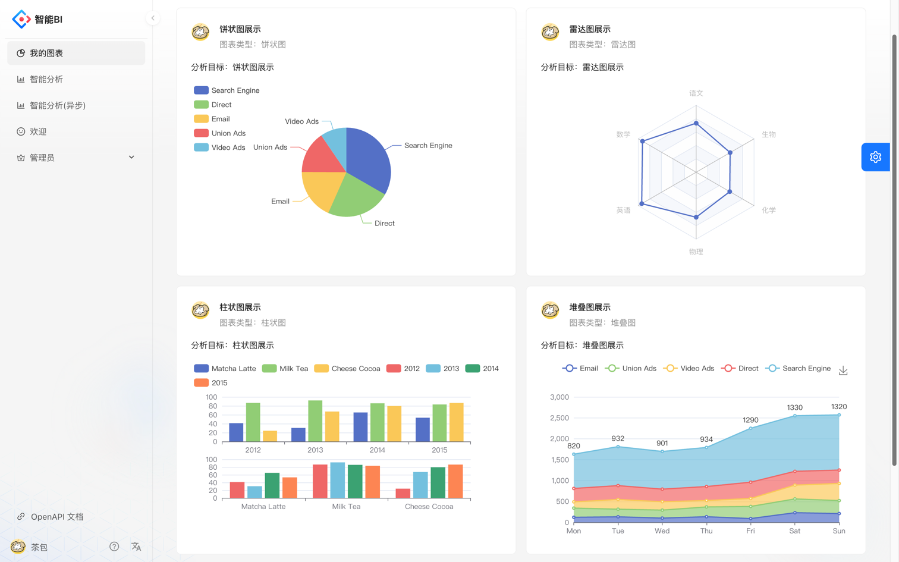
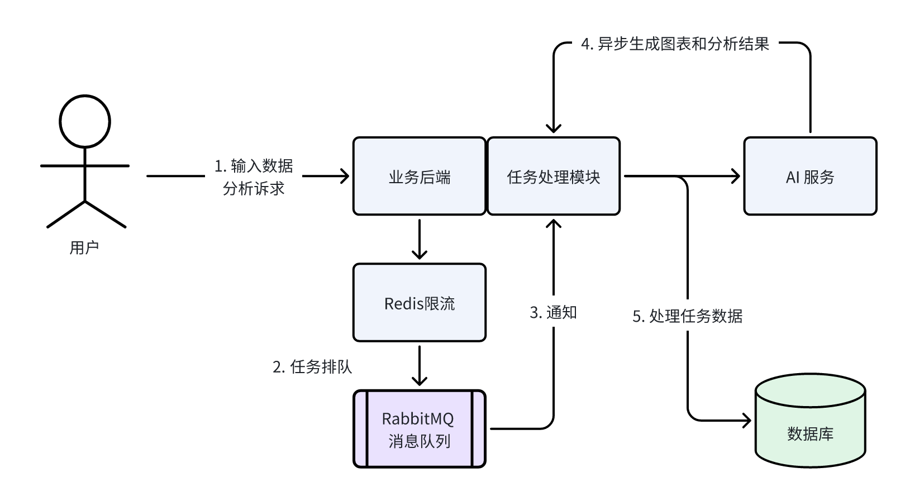
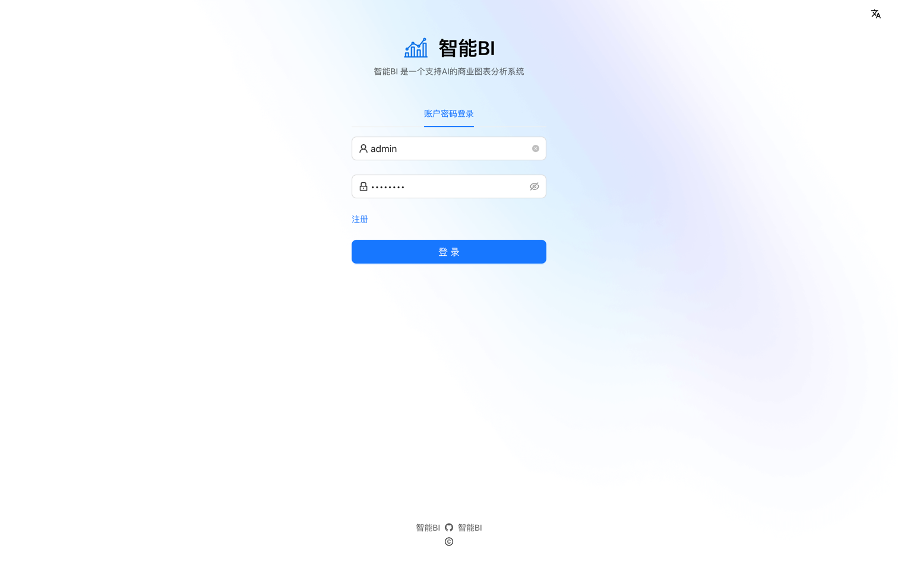
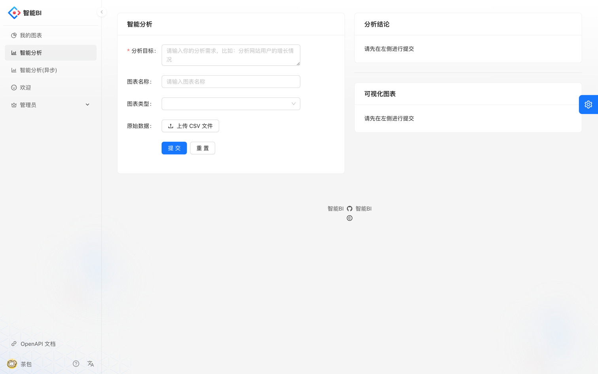
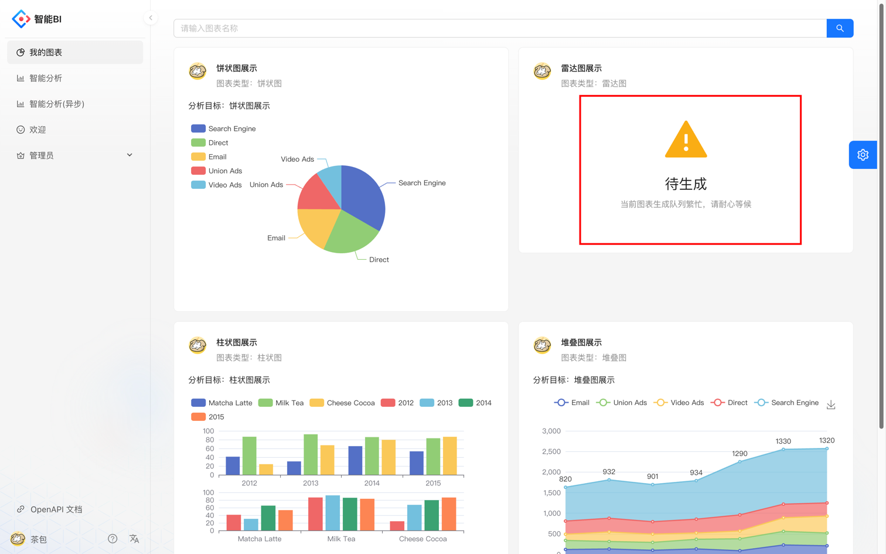

# 智能数据分析平台后端

欢迎使用智能数据分析平台的后端部分。本项目旨在提供高效、稳定的后端服务，支持复杂的业务逻辑和数据处理。

## 🍻项目描述
基于 Spring Boot + MQ + AIGC + React 的智能数据分析平台。区别于传统 BI 平台，用户只需要导入
原始数据集、并输入分析诉求，就能自动生成可视化图表及分析结论，实现数据分析的降本增效。

系统加构图：
登陆界面：
智能分析页面：
支持异步分析：


## 🚀技术栈

- **语言**: Java
- **框架**: SSM + Spring Boot
- **数据库**: MySQL, Redis
- **消息队列**: RabbitMQ
- **并发处理**: CompletableFuture, 自定义线程池
- **其他工具**: Git, IDEA, ChatGPT, Swagger, Navicat

## 🔧主要功能

1. **Java 知识**: 熟悉集合类和异常处理，能够熟练运用 Lambda, Hutool, Easy Excel, Apache Utils 进行编程。
2. **框架使用**: 使用 SSM + Spring Boot 框架，结合 MyBatis Plus 和 MyBatis X 自动生成基础 CRUD 代码。
3. **数据库设计**: 熟悉 MySQL 数据库及库表设计，通过创建索引和分布分表优化性能。
4. **并发编程**: 使用 CompletableFuture 等 JUC 类实现并发和操作异步化，自定义线程池提高效率。
5. **缓存和分布式锁**: 基于 Redis 实现分布式缓存和分布式锁，使用 Redisson 实现分布式限流。
6. **消息队列**: 使用 RabbitMQ 实现主动消息确认、消息持久化、交换机队列定义、消息生产和消费。
7. **开发工具**: 使用 Git, IDEA, ChatGPT, Swagger, Navicat 提高开发协作效率。

## 📚快速开始

请参考以下步骤来启动项目：

1. 克隆仓库:
    ```bash
    git clone https://github.com/chabao18/SmartBI-backend.git
    ```

2. 进入项目目录:
    ```bash
    cd smartbi-backend
    ```

3. 配置数据库:
    - 修改 `application.properties` 文件，配置数据库连接信息。

4. 启动项目:
    ```bash
    mvn spring-boot:run
    ```

5. 访问 Swagger 文档:
   打开浏览器访问 `http://localhost:8080/api/doc.html` 查看接口文档。

## 🤝贡献
欢迎贡献代码和提出意见！请提交 Pull Request 或 Issue。
感谢你的使用！🎉
