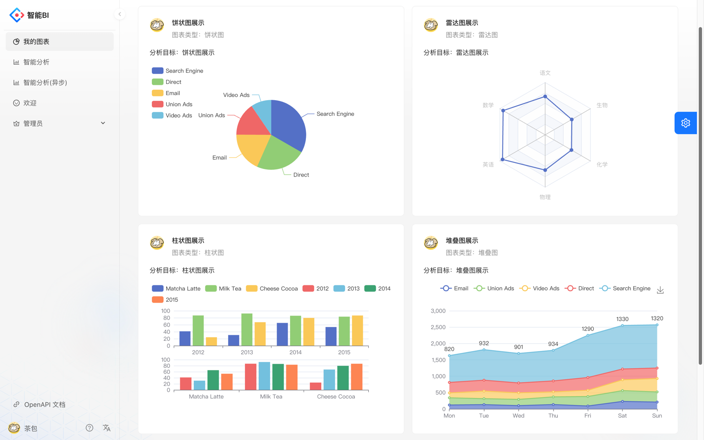
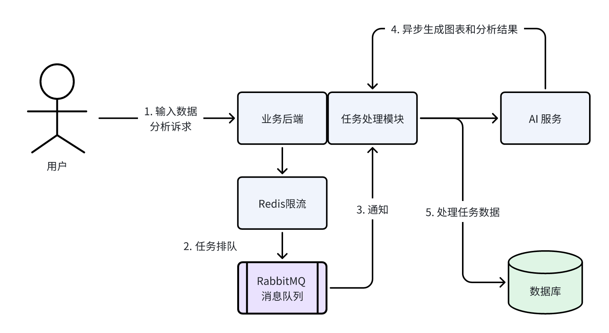
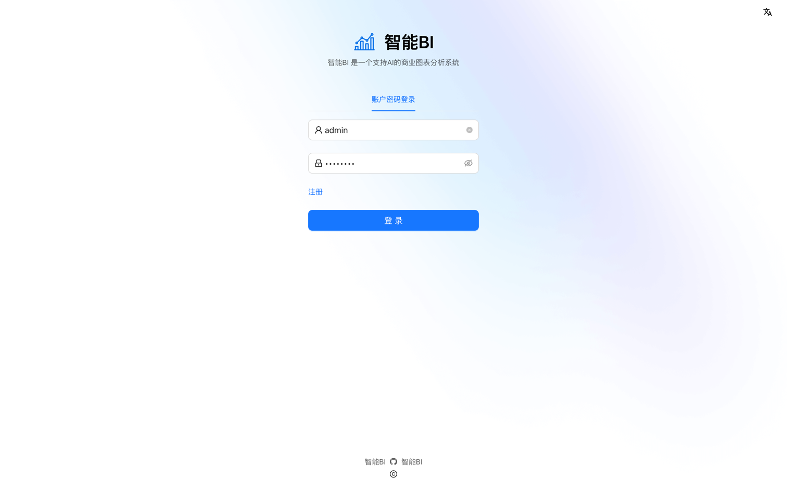
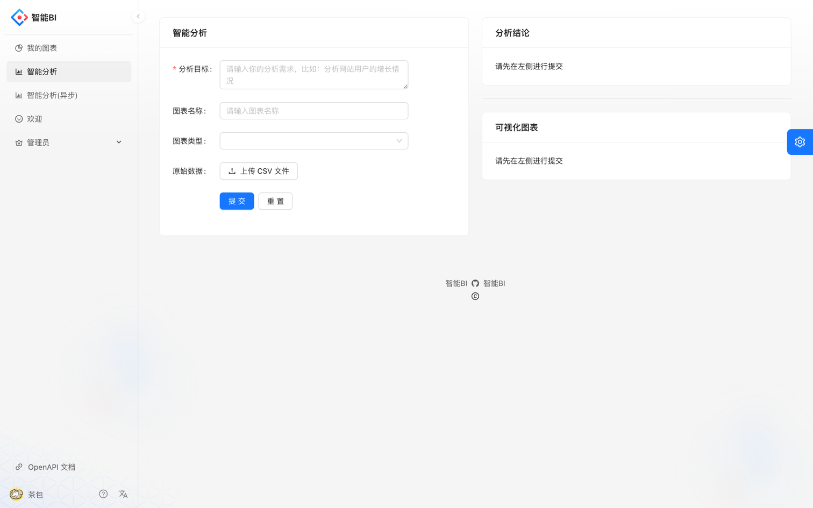
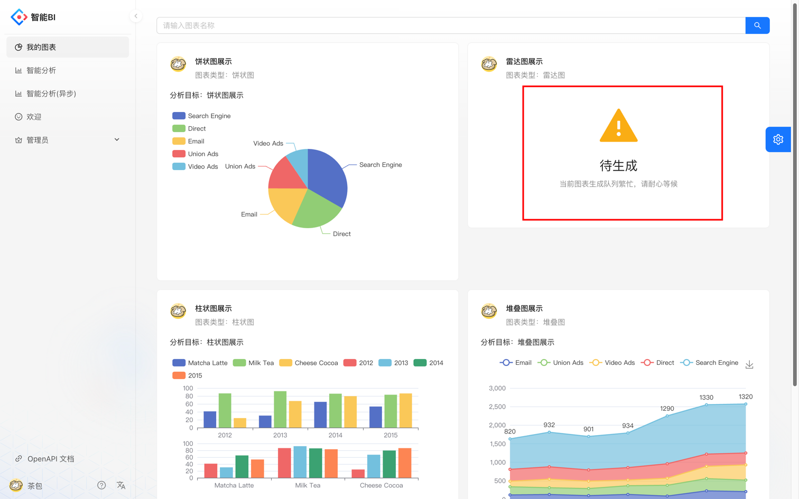

# Smart BI Platform Backend

**[中文版本](./README_zh.md) | English**

Welcome to the backend part of the Smart Data Analysis Platform. This project aims to provide efficient and stable backend services, supporting complex business logic and data processing.


## 🍻 Project Description
An intelligent data analysis platform based on Spring Boot + MQ + AIGC + React. Unlike traditional BI platforms, users only need to import raw datasets and input analysis requirements to automatically generate visualized charts and analysis conclusions, achieving cost reduction and efficiency improvement in data analysis.

System Architecture: 
Login Interface: 
Intelligent Analysis Page: 
Asynchronous Analysis Support: 


## 🚀 Tech Stack

- **Language**: Java
- **Framework**: SSM + Spring Boot
- **Database**: MySQL, Redis
- **Message Queue**: RabbitMQ
- **Concurrent Processing**: CompletableFuture, Custom Thread Pool
- **Other Tools**: Git, IDEA, ChatGPT, Swagger, Navicat

## 🔧 Key Features

1. **Java Knowledge**: Proficient in collections and exception handling, skilled in using Lambda, Hutool, Easy Excel, Apache Utils for programming.
2. **Framework Usage**: Uses SSM + Spring Boot framework, combined with MyBatis Plus and MyBatis X to automatically generate basic CRUD code.
3. **Database Design**: Familiar with MySQL database and table design, optimizing performance through indexing and sharding.
4. **Concurrent Programming**: Uses CompletableFuture and other JUC classes for concurrency and asynchronous operations, custom thread pools for improved efficiency.
5. **Caching and Distributed Locks**: Redis-based distributed caching and distributed locks, using Redisson for distributed rate limiting.
6. **Message Queue**: Uses RabbitMQ for active message acknowledgment, message persistence, exchange queue definition, message production and consumption.
7. **Development Tools**: Uses Git, IDEA, ChatGPT, Swagger, Navicat to improve development collaboration efficiency.


## 📚 Quick Start

Please follow these steps to start the project:

1. Clone the repository:
    ```bash
    git clone https://github.com/chabao18/SmartBI-backend.git
    ```

2. Enter the project directory:
    ```bash
    cd smartbi-backend
    ```

3. Configure the database:
    - Modify the `application.properties` file to configure database connection information.

4. Start the project:
    ```bash
    mvn spring-boot:run
    ```

5. Access Swagger documentation:
   Open your browser and visit `http://localhost:8080/api/doc.html` to view the API documentation.

## 🤝 Contributing
Code contributions and suggestions are welcome! Please submit Pull Requests or Issues.
Thank you for using this project! 🎉
